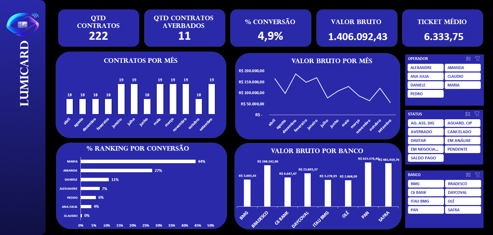
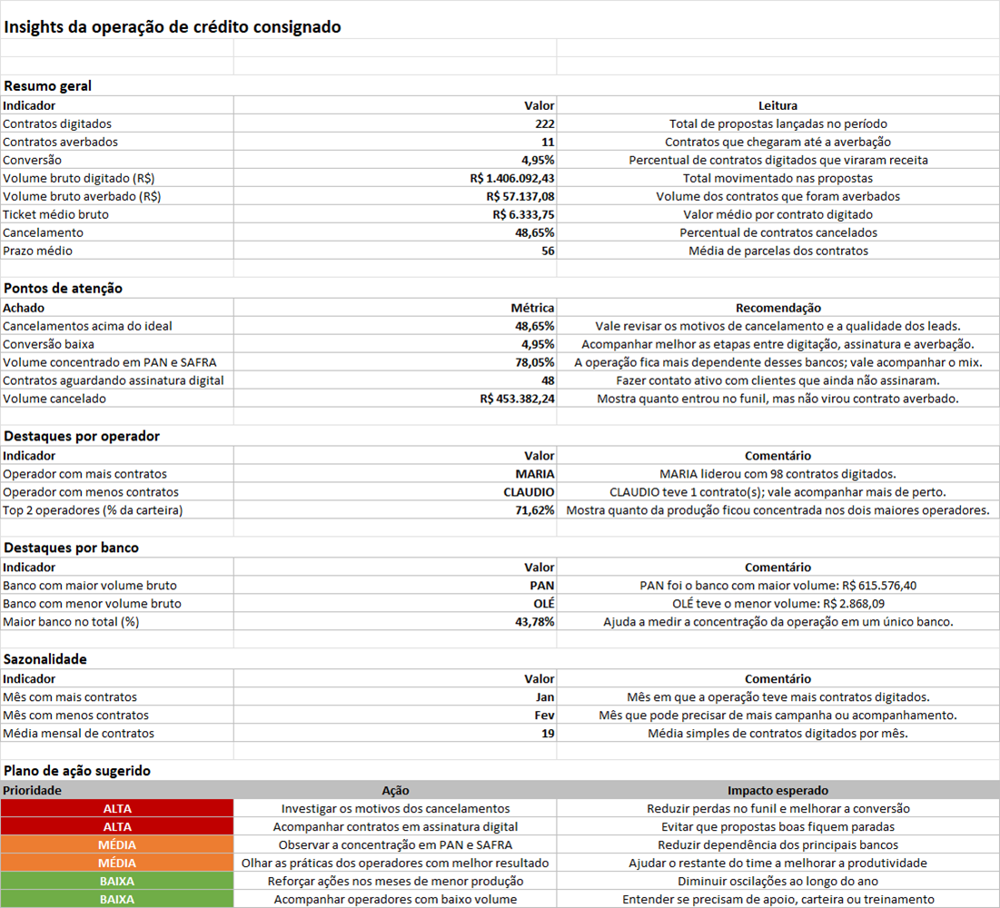

# LUMICRED - Dashboard de Crédito Consignado


Projeto de dashboard em Excel para análise de uma operação de crédito consignado INSS. A proposta foi transformar uma base de contratos em uma visão simples para acompanhar produção, conversão, volume financeiro, bancos parceiros e desempenho dos operadores.

Os dados são fictícios e foram usados apenas para estudo e portfólio.

## Dashboard



## Insights



## Arquivo principal

[`LUMICRED - Crédito Consignado.xlsx`](LUMICRED%20%20ANALYTICS/LUMICRED%20-%20Cr%C3%A9dito%20Consignado.xlsx)

## Acesso no Google Sheets

[Acessar no Google Sheets](COLE_AQUI_O_LINK_DO_GOOGLE_SHEETS)

> O link do Google Sheets também fica parametrizado no VBA pela variável `linkGSheets`. Após publicar a planilha no Google Sheets, basta substituir `COLE_AQUI_O_LINK_DO_GOOGLE_SHEETS` pela URL real.

## Pontos-chave do projeto

- Tratamento da base no Power Query.
- Criação da tabela fato `fContratos`.
- Criação de tabelas auxiliares para calendário e operadores.
- Relacionamento entre tabelas para facilitar a análise.
- Construção de KPIs principais da operação.
- Ranking de operadores por produção e conversão.
- Análise de volume bruto por banco.
- Segmentações por operador, status e banco.
- Aba `Insights` com leitura dos principais pontos de atenção.

## KPIs acompanhados


- Quantidade de contratos digitados.
- Quantidade de contratos averbados.
- Percentual de conversão.
- Valor bruto total.
- Ticket médio.

## Modelo e relacionamento


O modelo foi organizado com a base principal de contratos e tabelas de apoio para análise por data e operador.


As visualizações ajudam a identificar:

- meses com maior ou menor volume de contratos;
- bancos com maior participação no volume bruto;
- operadores com maior produção;
- concentração de contratos por status;
- gargalos na conversão.

## Automação com VBA

Além do dashboard, o projeto também conta com uma macro em VBA para gerar e enviar automaticamente um relatório por e-mail. A automação captura a área principal do dashboard como imagem, monta um corpo de e-mail em HTML com os indicadores e adiciona um botão para acesso ao Google Sheets.

A utilização do VBA foi desenvolvida com apoio de engenharia de prompt e correções minuciosas até o funcionamento final da ferramenta. Os ajustes envolveram principalmente a exportação do dashboard como imagem, a montagem do HTML, o vínculo da imagem no corpo do e-mail via CID e o envio automático pelo Outlook.

### Resultado do envio por e-mail


<details>
<summary>Código VBA utilizado</summary>

```vb
Option Explicit

Sub EnviarRelatorioGestor()

    Dim wsDB As Worksheet
    Dim wsInsights As Worksheet
    Dim oOutlook As Object
    Dim oMail As Object
    Dim oAttach As Object
    Dim oChart As ChartObject
    Dim imgPath As String
    Dim sInsights As String
    Dim sHTML As String
    Dim linkGSheets As String
    Dim rng As Range

    Const DESTINATARIO As String = "gabrielsleite7@gmail.com"
    Const ASSUNTO As String = "Relatório LUMICRED — Crédito Consignado"

    On Error GoTo TrataErro

    linkGSheets = "COLE_AQUI_O_LINK_DO_GOOGLE_SHEETS"

    Set wsDB = ThisWorkbook.Sheets("Dashboard")
    Set wsInsights = ThisWorkbook.Sheets("Insights")
    Set rng = wsDB.Range("A1:AB41")

    imgPath = Environ$("TEMP") & "\dashboard_lumicred.png"

    rng.CopyPicture Appearance:=xlScreen, Format:=xlPicture

    Set oChart = wsDB.ChartObjects.Add( _
        Left:=rng.Left, _
        Top:=rng.Top, _
        Width:=rng.Width, _
        Height:=rng.Height)

    With oChart
        .Activate
        .Chart.Paste
        .Chart.Export Filename:=imgPath, FilterName:="PNG"
        .Delete
    End With

    sInsights = BuildInsightsHTML(wsInsights)

    sHTML = "<html><body style='font-family:Segoe UI,Arial;color:#1a1a2e;background:#f4f6fb;padding:0;margin:0;'>" & _
            "<div style='max-width:700px;margin:30px auto;background:#fff;border-radius:12px;overflow:hidden;box-shadow:0 4px 24px rgba(0,0,0,0.10);'>" & _
            "<div style='background:#1F3864;padding:28px 32px;text-align:center;'>" & _
            "<h1 style='color:#fff;margin:0;font-size:22px;'>LUMICRED — Crédito Consignado</h1>" & _
            "<p style='color:#a8c0e8;margin:6px 0 0;font-size:13px;'>Relatório Gerencial · " & Format(Now, "dd/mm/yyyy") & "</p>" & _
            "</div>" & _
            "<div style='padding:24px 32px 12px;'>" & _
            "<h2 style='color:#1F3864;font-size:15px;margin-bottom:12px;border-bottom:2px solid #e0e7f3;padding-bottom:8px;'>Visão Geral do Dashboard</h2>" & _
            "" & _
            "</div>" & _
            "<div style='padding:12px 32px 24px;'>" & _
            "<h2 style='color:#1F3864;font-size:15px;margin-bottom:14px;border-bottom:2px solid #e0e7f3;padding-bottom:8px;'>Insights e Pontos de Atenção</h2>" & _
            sInsights & _
            "</div>" & _
            "<div style='background:#eef3fb;padding:18px 32px;border-top:1px solid #dde3f0;'>" & _
            "<h2 style='color:#1F3864;font-size:14px;margin:0 0 10px;'>Acesse o Dashboard Interativo</h2>" & _
            "<p style='font-size:12px;color:#555;margin:0 0 10px;'>Clique no link abaixo para explorar os dados com filtros.</p>" & _
            "<a href='" & linkGSheets & "' style='display:inline-block;background:#1F3864;color:#fff;padding:10px 24px;border-radius:6px;text-decoration:none;font-size:13px;font-weight:bold;'>Abrir no Google Sheets</a>" & _
            "</div>" & _
            "<div style='background:#f4f6fb;padding:14px 32px;text-align:center;border-top:1px solid #dde3f0;'>" & _
            "<p style='font-size:11px;color:#999;margin:0;'>Relatório gerado automaticamente · " & Format(Now, "dd/mm/yyyy HH:nn") & "</p>" & _
            "</div>" & _
            "</div></body></html>"

    Set oOutlook = CreateObject("Outlook.Application")
    Set oMail = oOutlook.CreateItem(0)

    With oMail
        .To = DESTINATARIO
        .Subject = ASSUNTO

        Set oAttach = .Attachments.Add(imgPath)
        oAttach.PropertyAccessor.SetProperty _
            "http://schemas.microsoft.com/mapi/proptag/0x3712001F", "dashboard_img"

        .HTMLBody = sHTML
        .send
    End With

    MsgBox "Relatório preparado com sucesso!", vbInformation, "LUMICRED"

    Exit Sub

TrataErro:
    MsgBox "Erro ao gerar relatório:" & vbCrLf & Err.Description, vbCritical, "LUMICRED"

End Sub

Private Function BuildInsightsHTML(ws As Worksheet) As String

    Dim html As String

    html = "<table style='width:100%;border-collapse:collapse;font-size:12px;'>"

    html = html & "<tr><td colspan='2' style='background:#1F3864;color:#fff;padding:8px 12px;font-weight:bold;'>Resumo Geral</td></tr>"
    html = html & TableRow("Contratos Digitados", "222", "#f0f4ff")
    html = html & TableRow("Contratos Averbados", "11", "#fff")
    html = html & TableRow("Taxa de Conversão", "4,9%", "#f0f4ff")
    html = html & TableRow("Volume Bruto Digitado", "R$ 1.406.092,43", "#fff")
    html = html & TableRow("Volume Bruto Averbado", "R$ 57.137,08", "#f0f4ff")
    html = html & TableRow("Ticket Médio Bruto", "R$ 6.333,75", "#fff")
    html = html & TableRow("Taxa de Cancelamento", "48,6%", "#fff8f0")
    html = html & TableRow("Prazo Médio", "56 parcelas", "#f0f4ff")

    html = html & "<tr><td colspan='2' style='height:10px;'></td></tr>"
    html = html & "<tr><td colspan='2' style='background:#b22222;color:#fff;padding:8px 12px;font-weight:bold;'>Pontos de Atenção</td></tr>"
    html = html & TableRow("Cancelamentos acima do ideal", "Revisar motivos e qualidade dos leads", "#fff5f5")
    html = html & TableRow("Conversão baixa", "Acompanhar digitação, assinatura e averbação", "#fff5f5")
    html = html & TableRow("Concentração em PAN e SAFRA", "Reduzir dependência de bancos específicos", "#fff5f5")
    html = html & TableRow("48 contratos aguardando assinatura", "Fazer contato ativo com clientes pendentes", "#fff5f5")

    html = html & "<tr><td colspan='2' style='height:10px;'></td></tr>"
    html = html & "<tr><td colspan='2' style='background:#155724;color:#fff;padding:8px 12px;font-weight:bold;'>Destaques por Operador</td></tr>"
    html = html & TableRow("Top operador", "MARIA — 98 contratos", "#f0fff4")
    html = html & TableRow("Menor volume", "CLAUDIO — 1 contrato", "#fff5f5")

    html = html & "</table>"

    BuildInsightsHTML = html

End Function

Private Function TableRow(label As String, valor As String, bgColor As String) As String

    TableRow = "<tr style='background:" & bgColor & ";'>" & _
               "<td style='padding:7px 10px;border-bottom:1px solid #e8ecf5;color:#555;width:45%;'>" & label & "</td>" & _
               "<td style='padding:7px 10px;border-bottom:1px solid #e8ecf5;font-weight:bold;color:#1F3864;'>" & valor & "</td>" & _
               "</tr>"

End Function
```

</details>

## Fórmulas usadas

Algumas fórmulas aplicadas no projeto:

```excel
=CONT.VALORES(fContratos[Nº CONTRATO])
=CONT.SES(fContratos[AVERBADO];1)
=SOMA(fContratos[VLR BRUTO])
=SOMASES(fContratos[VLR BRUTO];fContratos[AVERBADO];1)
=CONT.SE(fContratos[STATUS];"CANCELADO")/CONT.VALORES(fContratos[STATUS])
=MÉDIA(fContratos[PRAZO])
=ÍNDICE(Analises!B21:B27;CORRESP(MÁXIMO(Analises!C21:C27);Analises!C21:C27;0))
```

## Principais aprendizados

- O dashboard facilitou a leitura da operação em poucos indicadores.
- A conversão foi um dos pontos mais importantes da análise.
- O cancelamento apareceu como ponto de atenção.
- A produção ficou concentrada em alguns operadores.
- Alguns bancos concentraram grande parte do volume bruto.

## Ferramentas utilizadas

- Microsoft Excel
- Power Query
- Fórmulas Excel
- Tabelas Dinâmicas
- Gráficos Dinâmicos
- Segmentação de Dados
